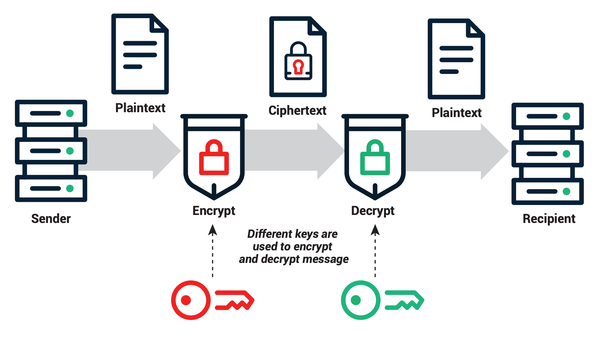

<!--
title: Lecture 01
paginate: true
theme: custom
_class: titlepage
-->

# Lecture 01
<br>

## Introduction to the course. The UNIX shell. The build process.
<br>

#### Advanced Programming - SISSA, UniTS, 2024-2025

###### Pasquale Claudio Africa

###### 30 Sep 2024

---

# About me
- B.Sc. and M.Sc. in *Mathematical Engineering*, Politecnico di Milano, 2010-2015.
- Ph.D. in *Mathematical Models and Methods in Engineering*, Politecnico di Milano, 2019. 
- Assistant Professor (RTDa) in Numerical Analysis at SISSA since March 2023.

# Teaching experience
Advanced programming, numerical analysis, mathematical modeling and scientific computing. Main languages: C++, MPI, OpenMP, Python, MATLAB/Octave.

# Research interests
High-Performance Computing (HPC), mathematical models and computational methods to solve problems in science and engineering, numerical methods for Partial Differential Equations (PDEs).

---

<!--
_class: titlepage
-->

# Course overview

---

# Practical info
- **Instructor**: Pasquale Claudio Africa <pafrica@sissa.it>
- **Tutor**: Giuseppe Alessio D'Inverno <gdinvern@sissa.it>

# Course material
- [GitHub](https://github.com/pcafrica/advanced_programming_2024-2025): timetable, lecture notes and slides, exercise sessions.
- [Google Classroom](https://classroom.google.com/c/NzExNzIzMTkxMTI5?cjc=n6fosq6): homeworks, exams.

# Other resources
- Books (see course syllabus on MOODLE2/GitHub).
- Internet (plenty of free or paid resources).

---

# Practical info

Lectures at SISSA. Check out [GitHub](https://github.com/pcafrica/advanced_programming_2024-2025) regularly for up-to-date timetable, lecture topics, rooms, and course material.

Course balance (approximate):
- C++: **70%**, Python: **30%**.
- Frontal lectures: **50%**, live programming sessions: **50%**.

For live programming sessions please **bring your own laptop**.

# Questions?
- Use Discussions on GitHub.
- Engage with each other!
- **Office hours**: send me or the tutor an email to book a session.

---

# Objectives and expectations
- UNIX shell and the software build process.
- Advanced programming concepts, specifically in C++ and Python.
- Object-oriented and generic programming paradigms.
- Common data structures, algorithms, libraries for scientific computing.
- Software development tools in UNIX/Linux (software documentation, version control, testing, and project management).

# Required skills
- Former knowledge of programming fundamentals (syntax, data types, variables, control structures, functions).
- Prior experience with C, C++, Java, or Python, is **recommended**, not mandatory.

---

# Exams

1. (Optional) **Homework assignments** (up to 5 points):
   - Throughout the course, you will be assigned 2-4 homework projects to complete either individually or in groups of up to 3 students.
2. **Main exam** (up to 27 points):
   - Theoretical questions (paper-based) and programming exercises (computer-based).

3. (Optional) **Oral discussion**, upon request (by either students or the instructor). It can increase or decrease your grade by up to 3 points.

Maximum achievable grade: **30** + honors (granted in exceptional cases).

---

# Some advice

1. **Study day by day**
   - Create a study schedule and set clear goals.
   - Prioritize consistency.

2. **Practice regularly**
   - Solve exercises on your own.
   - Programming is (mostly) learnt by doing, not by reading.

3. **Interact**:
   - Engage in discussions on GitHub.
   - Seek help when needed.
   - **Share your knowledge with others**.

---

# Laptop configuration

Please **bring your own laptop** with a working UNIX/Linux environment, whether standalone, dual boot, or virtualized.

For beginners: https://ubuntu.com/tutorials/install-ubuntu-desktop.
 
You can write code using any **text editor** (such as Emacs, Vim, or Nano), or an Integrated Development Environment (**IDE**) (such as VSCode, Eclipse, or Code::Blocks).

# Requirements
- C++ compiler with full support for C++17, such as GCC $\geq$ 10, or Clang $\geq$ 11.
- Python 3. [Jupyter](https://docs.jupyter.org/en/latest/install/notebook-classic.html) is recommended, but not mandatory.

Any recent Linux distribution, such as Ubuntu $\geq$ 22.04, or Debian $\geq$ 11, or macOS system that meets these requirements should be suitable for the course.

---

# Windows users
- [Windows Subsystem for Linux (WSL2)](https://learn.microsoft.com/en-us/windows/wsl/install). Ubuntu version recommended, then follow Ubuntu-specific instructions.
- Virtual machine (such as [VirtualBox](https://www.virtualbox.org/)).
- (**Expert users**) [Dual boot](https://www.xda-developers.com/dual-boot-windows-11-linux/).

# macOS users
- [Xcode](https://developer.apple.com/xcode/): provides Clang.
- [Homebrew](https://brew.sh/): provides GCC, Clang, Python 3.

# Linux users
- Install GCC and Python 3 using your package manager (such as apt, yum, pacman).

---

# Industry demands for advanced programming skills
- Rapid technological advancements.
- Need for scalable and efficient software solutions.
- Increased reliance on data-driven decision-making.
- Job market competitiveness and higher earning potential for skilled programmers.

**Career opportunities:**
- **Software developer**: Design and develop software applications.
- **Systems architect**: Plan and design complex software systems.
- **Data scientist/engineer**: Analyze and process data using advanced algorithms.
- **DevOps engineer**: Automate software development and deployment processes.
- **Cybersecurity analyst**: Secure software systems and networks.
- **Research & Development**: Contribute to scientific research with innovative solutions.

---

# Importance of advanced programming skills (1/2)
- **Data manipulation**: C++ and Python enable efficient handling of large datasets and complex data structures.
- **Algorithm development**: Proficiency in these languages is crucial for coding and optimizing complex mathematical and scientific algorithms.
- **Tool integration**: Advanced programming skills facilitate the integration of various tools and libraries for data analysis and scientific computing.
- **Customization**: C++ and Python allow customization of software tools to meet specific project requirements.
- **Performance optimization**: These languages enable the writing of high-performance code, vital for resource-intensive calculations.
- **Machine learning**: Python is a primary language for machine learning, and C++ can be used for performance-critical components.

---

# Importance of advanced programming skills (2/2)
- **Visualization**: Python's libraries like Matplotlib and C++'s graphics capabilities aid in creating informative visualizations.
- **Reproducibility**: Well-structured code in C++ and Python ensures research reproducibility and collaboration.
- **Prototyping**: Python facilitates rapid prototyping and experimentation for hypothesis testing and model development.
- **Automation**: Automation of repetitive tasks in data preprocessing and analysis streamlines workflows.
- **Security**: C++ can be employed for secure and efficient data handling, important in data science and scientific computing.
- **Scalability**: Both languages are suitable for building scalable systems and algorithms to handle growing data and computing needs.

---

# Why should I learn programming in the ChatGPT era?

1. You can't really understand/modify/improve a text written in English, unless you are proficient in English!
2. Career opportunities:
   - Coding opens doors to a diverse array of high-demand careers in technology and data-driven sectors.
   - It cultivates critical thinking and problem-solving skills.
3. Artificial Intelligence (AI) and chatbots **lack** creativity!
   - They derive knowledge from historical data.
   - Innovation, idea generation, implementation of novel concepts through software and technology remain a **human** prerogative (at least for now :sweat_smile:).
5. Understand how AI and chatbots work under the hood.

---

<!--
_class: titlepage
-->

## Reminder for DSAI/SDIC students: Welcome Day
- When: 02 Oct, 19:30
- Where: Loop (via Amilcare Ponchielli, 3)

# Welcome to the Advanced Programming course!
<br>

---

# Outline

1. History of C++.
2. History of Python.
3. The build process.
4. Introduction to the UNIX shell.
5. Introduction to `git`.

---

<!--
_class: titlepage
-->

# History of C++

---

# History of C++

## Introduction

The history of the C++ programming language is a remarkable journey through the evolution of computer science and software development. C++, often considered a superset of the C programming language, was designed with the goal of combining the low-level power of C with high-level features for structured programming. This chapter explores the origins, key milestones, and influential figures that shaped C++ into the versatile and widely-used language it is today.

---

# The birth of C++

## Early roots: the C language
C++ owes its existence to the C programming language, which was developed at Bell Labs in the early 1970s by Dennis Ritchie. C quickly gained popularity due to its efficiency, portability, and the flexibility it offered to system programmers. Its simplicity, combined with powerful features for memory manipulation, made it a go-to language for developing operating systems and other system software.

---

# The birth of C++

## Bjarne Stroustrup's vision
The story of C++ begins in 1979 when Bjarne Stroustrup, a Danish computer scientist, started working on what he initially called "C with Classes." Stroustrup, then at Bell Labs, aimed to enhance C by adding support for object-oriented programming (OOP) concepts. His motivation was to create a language that could address the growing complexity of software systems while maintaining the performance and control of C.

---

# The birth of C++

## From C with classes to C++
Stroustrup's work on extending C led to the development of a preprocessor called "Cfront" in 1983. Cfront allowed C++ code to be translated into C code, which could then be compiled using standard C compilers. This approach eased the transition to C++ for existing C programmers.

In 1983, the name "C++" was coined, signifying the evolution of C with Classes. The term "C++" represents the incremental increase operator in C, suggesting that C++ is an improved version of C. In 1985, Stroustrup published the first edition of "The C++ Programming Language," a seminal book that introduced programmers to the language's concepts and features.

---

# Early growth and ANSI C++ standardization
As C++ gained popularity, there was a need for standardization to ensure compatibility across different compilers and platforms. In 1989, the American National Standards Institute (ANSI) began working on a standard for the C++ language. This effort culminated in the release of the ANSI C++ standard in 1998, which provided a formal specification of the language.
<br>

See https://isocpp.org/ for language references, guidelines, and much more.

---

# Object-oriented paradigm
C++ introduced essential features of the OOP paradigm, including classes, objects, inheritance, and polymorphism. These features allowed developers to build more modular and maintainable software by encapsulating data and behavior within objects.

# Generic programming
Another significant innovation in C++ was the introduction of templates. Templates allowed for generic programming, enabling the creation of data structures and algorithms that could work with different data types. Template metaprogramming, a technique that uses templates for compile-time computations, further expanded C++'s capabilities.

---

# C++ in the modern era

## Standardization efforts
The C++ language has continued to evolve through a series of standards, each introducing new features and improvements. Notable standards include C++98, C++11, C++14, C++17, C++20, C++23 (C++26 expected soon). These standards have added features like smart pointers, lambda expressions, range-based for loops, and modules, enhancing the language's expressiveness and safety.
<br>
## Open source and the C++ community
C++'s success can be attributed in part to the vibrant open-source community that has formed around it. Open-source libraries and frameworks, such as the Boost C++ Libraries, have extended C++'s functionality and encouraged collaborative development.

---

# The future of C++

C++ has found applications in a wide range of fields, including game development, finance, embedded systems, and scientific computing. Its combination of performance, portability, and expressive power makes it a versatile choice for building software across various domains.

C++ continues to evolve, with ongoing work on future language standards. Features like concepts (a type of compile-time constraint) and modules (for better code organization and encapsulation) from C++20 are expected to play a significant role in shaping the language's future.

The history of C++ is a testament to the enduring power of a well-designed programming language. From its humble beginnings as an extension of C to its status as a modern, versatile language, C++ has left an indelible mark on the world of software development. Its rich history, coupled with ongoing innovations, ensures that C++ will remain a vital tool for programmers for years to come.

---

<!--
_class: titlepage
-->

# History of Python

---

# History of Python

## Introduction
Python is a versatile and widely-used programming language known for its simplicity, readability, and the ease with which it allows developers to write clean and maintainable code. This chapter delves into the rich history of Python, tracing its origins, key milestones, and the individuals who played pivotal roles in its development.

---

# The genesis of Python

## Python's name and design philosophy
Python was created by Guido van Rossum, a Dutch programmer, in the late 1980s. Guido started working on Python in December 1989 during his time at the Centrum Wiskunde & Informatica (CWI) in the Netherlands. His motivation was to develop a language that combined the simplicity of ABC (a programming language he had worked on previously) with the extensibility of the Amoeba operating system.

Guido named the language after his love for the British comedy group Monty Python. Python's design philosophy, often referred to as the *"Zen of Python"* emphasizes readability, simplicity, and elegance. This philosophy is encapsulated in the [PEP 20](https://peps.python.org/pep-0020/) document, which includes guiding aphorisms like *"Readability counts"* and *"There should be one - and preferably only one - obvious way to do it"*.

---

# Python's early years

## Python 0.9.0
Python's first public release, Python 0.9.0, occurred in February 1991. This release introduced essential features like exception handling, functions, and modules, which laid the foundation for the language's future growth.
<br>
## The Python Software Foundation
In 2001, the Python Software Foundation (PSF) was established as a non-profit organization to promote and support Python. The PSF plays a crucial role in managing Python's development, organizing conferences (e.g., PyCon), and providing grants and resources to the Python community.

---

# Python 2.x and 3.x

## The transition to Python 3
Python 2.x and Python 3.x marked a significant phase in Python's history. Python 3, released in December 2008, introduced backward-incompatible changes to address shortcomings in the language. While Python 2 continued to be used for some time, the Python community has actively encouraged the transition to Python 3.

---

# Python's popularity and versatility
Python's readability, simplicity, and extensive standard library contributed to its widespread adoption. It became a go-to language for web development, scientific computing, data analysis, and automation. Popular web frameworks like Django and Flask further fueled Python's growth.

## Python in Data science and Machine learning
Python gained prominence in data science and machine learning due to libraries like NumPy, pandas, scikit-learn, and TensorFlow. Its ease of use and rich ecosystem made it a favorite among data scientists and engineers.

## Python in education
Python's readability and simplicity have made it an excellent choice for teaching programming. It is widely used in educational settings to introduce programming concepts to beginners.

---

# The future of Python
Python continues to evolve through a series of releases, with each version bringing new features and enhancements. Python's community-driven development process ensures that the language remains vibrant and relevant.

Python is well-positioned to thrive in emerging areas like artificial intelligence, web development, and cloud computing. Its adaptability and large community ensure it can address a wide range of challenges.

The history of Python is a testament to the enduring impact of a well-designed programming language. From its inception in the late 1980s to its current status as a versatile and ubiquitous language, Python has empowered developers to create a diverse array of software solutions. Its readability, simplicity, and thriving community ensure that Python will remain a cornerstone of the programming landscape for years to come.

---

# Popularity of programming languages
<br>


<br>

Source: https://pypl.github.io/PYPL.html

---

# Curated lists of awesome C++ and Python frameworks, libraries, resources, and shiny things.
<br><br>

- ## [awesome-cpp](https://github.com/fffaraz/awesome-cpp)
- ## [awesome-python](https://github.com/vinta/awesome-python)
- ## [awesome-scientific-python](https://github.com/rossant/awesome-scientific-python)
- ## [awesome-scientific-computing](https://github.com/nschloe/awesome-scientific-computing)

---

<!--
_class: titlepage
-->

# The build process:<br>Preprocessor, Compiler, Linker, Loader

---

# Chapter overview

- Understand the difference between compiled and interpreted languages.
- Understand the build process.
- Explore the roles of the preprocessor, compiler, linker, and loader.

---

# Compiled vs. interpreted languages


---

# The build process


---

# Preprocessor
- Handles directives and macros before compilation.
- Originated for code reusability and organization.

### Preprocessor directives
- `#include`: Includes header files.
- `#define`: Defines macros for code replacement.
- `#ifdef`, `#ifndef`, `#else`, `#endif`: Conditional compilation.
- `#pragma`: Compiler-specific directives.

### Macros
- Example: `#define SQUARE(x) ((x) * (x))`
- Usage: `int result = SQUARE(5); // Expands to: ((5) * (5))`

---

# Compiler
- Translates source code into assembly/machine code.
- Evolved with programming languages and instructions.

### Compilation process
1. Lexical analysis: Tokenization.
2. Syntax analysis (parsing): Syntax tree.
3. Semantic analysis: Checking.
4. Code generation: Assembly/machine code.
5. Optimization: Efficiency improvement.
6. Output: Object files. Example: `g++ main.cpp -o main.o`

### Common compiler options
`-O`: Optimization levels; `-g`: Debugging info; `-std`: C++ standard.

---

# Linker
- Combines object files into an executable.
- Supports modular code.

### Linking process
1. Symbol resolution: Match symbols.
2. Relocation: Adjust addresses.
3. Output: Executable.
4. Linker errors/warnings.
5. Example: `g++ main.o helper.o -o my_program`

### Static vs. dynamic linking
- Static: Larger binary, library inclusion.
- Dynamic: Smaller binary, runtime library reference.

---

# Loader
- Loads executables for execution.
- Tied to memory management evolution.

### Loading process
1. Memory allocation: Reserve memory.
2. Relocation: Adjust addresses.
3. Initialization: Set up environment.
4. Execution: Start execution.

### Dynamic linking at runtime
- Inclusion of external libraries during execution.
- Enhances flexibility.

---

<!--
_class: titlepage
-->

# Introduction to the UNIX shell

---

# What is a shell?


From [http://www.linfo.org/shell.html](http://www.linfo.org/shell.html):

> A shell is a program that provides the traditional, text-only user interface for Linux and other UNIX-like operating systems. Its primary function is to read commands that are typed into a console [...] and then execute (i.e., run) them. The term shell derives its name from the fact that it is an outer layer of an operating system. A shell is an interface between the user and the internal parts of the OS (at the very core of which is the kernel).

---

# What shells are available?

`Bash` stands for: `Bourne Again Shell`, a homage to its creator Stephen Bourne. It is the default shell for most UNIX systems and Linux distributions. It is both a command interpreter and a scripting language. The shell might be changed by simply typing its name and even the default shell might be changed for all sessions.

macOS has replaced it with [zsh](https://support.apple.com/en-us/HT208050), which is mostly compatible with `Bash`, since v10.15 Catalina.

Other shells available: tsh, ksh, csh, Dash, Fish, Windows PowerShell, ...

---

# Variables and environmental variables

As shell is a program, it has its variables. You can assign a value to a variable with the equal sign **(no spaces!)**, for instance type `A=1`. You can then retrieve its value using the dollar sign and curly braces, for instance to display it the user may type `echo ${A}`. Some variables can affect the way running processes will behave on a computer, these are called **environmental variables**. For this reason, some variables are set by default, for instance to display the user home directory type `echo ${HOME}`. To set an environmental variable just prepend `export`, for instance `export PATH="/usr/sbin:$PATH"` adds the folder `/usr/sbin` to the `PATH` environment variable. `PATH` specifies a set of directories where executable programs are located.

---

# Types of shell (login vs. non-login)

- A **login** shell logs you into the system as a specific user (it requires username and password). When you hit `Ctrl+Alt+F1` to login into a virtual terminal you get after successful login: a login shell (that is interactive).
- A **non-login** shell is executed without logging in (it requires a current logged in user). When you open a graphic terminal it is a non-login (interactive) shell. 

---

# Types of shell (interactive vs. non-interactive)

- In an **interactive** shell (login or non-login) you can interactively type or interrupt commands. For example a graphic terminal (non-login) or a virtual terminal (login). In an interactive shell the prompt variable must be set (`$PS1`).
- A **non-interactive** shell is usually run from an automated process. Input and output are not exposed (unless explicitly handled by the calling process). This is normally a non-login shell, because the calling user has logged in already. A shell running a script is always a non-interactive shell (but the script can emulate an interactive shell by prompting the user to input values).

---

# The shell as a command line interpreter

When launching a terminal a UNIX system first launches the shell interpreter specified in the `SHELL` **environment variable**. If `SHELL` is unset it uses the system default.

After having sourced the initialization files, the interpreter shows the **prompt** (defined by the environment variable `$PS1`).

Initialization files are hidden files stored in the user's home directory, executed as soon as an **interactive** shell is run. 

---

# Initialization files

Initialization files in a shell are scripts or configuration files that are executed or sourced when the shell starts. These files are used to set up the shell environment, customize its behavior, and define various settings that affect how the shell operates.

- **login**:
  - `/etc/profile`, `/etc/profile.d/*`, `~/.profile` for Bourne-compatible shells
  - `~/.bash_profile` (or `~/.bash_login`) for `Bash`
  - `/etc/zprofile`, `~/.zprofile` for `zsh`
  - `/etc/csh.login`, `~/.login` for `csh`

- **non-login**: `/etc/bash.bashrc`, `~/.bashrc` for `Bash`

---

# Initialization files

- **interactive**:
  - `/etc/profile`, `/etc/profile.d/*` and `~/.profile`
  - `/etc/bash.bashrc`, `~/.bashrc` for `Bash`

- **non-interactive**:
  - `/etc/bash.bashrc` for `Bash` (but most of the times the script begins with: `[ -z "$PS1" ] && return`, *i.e.* don't do anything if it's a non-interactive shell).
  - depending on the shell, the file specified in `$ENV` (or `$BASH_ENV`)  might be read.

---

# Getting started
To get a little hang of the shell, let’s try a few simple commands:
- `echo`: prints whatever you type at the shell prompt.
- `date`: displays the current time and date.
- `clear`: clean the terminal.

---

# Basic shell commands (1/2)

- `pwd` stands for **Print working directory** and it points to the current working directory, that is, the directory that the shell is currently looking at. It’s also the default place where the shell commands will look for data files.
- `ls` stands for a **List** and it lists the contents of a directory. ls usually starts out looking at our home directory. This means if we print ls by itself, it will always print the contents of the current directory.
- `cd` stands for **Change directory** and changes the active directory to the path specified.

---

# Basic shell commands (2/2)

- `cp` stands for **Copy** and it moves one or more files or directories from one place to another. We need to specify what we want to move, i.e., the source and where we want to move them, i.e., the destination.
- `mv` stands for **Move** and it moves one or more files or directories from one place to another. We need to specify what we want to move, i.e., the source and where we want to move them, i.e., the destination.
- `touch` command is used to create new, empty files. It is also used to change the timestamps on existing files and directories.
- `mkdir` stands for **Make directory** and is used to make a new directory or a folder.
- `rm` stands for **Remove** and it removes files or directories. By default, it does not remove directories, unless you provide the flag `rm -r` (`-r` means recursively).<br>:warning: **Warning**: Files removed via `rm` are lost forever, please be careful!

---

# Shell scripts

Commands can be written in a **script file**, i.e. a text file that can be executed.

Remember that the **first line of the script** (the so-called *shebang*) tells the shell which interpreter to use while executing the file. So, for example, if your script starts with `#!/bin/bash` it will be run by `Bash`, if is starts with `#!/usr/bin/env python` it will be run by `Python`.

To run your brand new script you may need to change the access permissions of the file. To make a file executable run
```bash
chmod +x script_file
```

---

# Not all commands are equals

When executing a command, like `ls` a subprocess is created. A subprocess inherits all the environment variables from the parent process, executes the command and returns the control to the calling process.

**A subprocess cannot change the state of the calling process.**

The command `source script_file` executes the commands contained in `script_file` as if they were typed directly on the terminal. It is only used on scripts that have to change some environmental variables or define aliases or function. Typing `. script_file` does the same.

If the environment should not be altered, use `./script_file`, instead.

---

# Built-in commands

Some commands, like `cd` are executed directly by the shell, without creating a subprocess.

Indeed it would be impossible to have `cd` as a regular command!

**The reason is**: a subprocess cannot change the state of the calling process, whereas `cd` needs to change the value of the environmental variable `PWD`(that contains the name of the current working directory).

---

# Other commands

In general a **command** can refer to:
  - A builtin command.
  - An executable.
  - A function.

The shell looks for executables with a given name within directories specified in the environment variable `PATH`, whereas aliases and functions are usually sourced by the `.bashrc` file (or equivalent).

- To check what `command_name` is: `type command_name`.
- To check its location: `which command_name`.

---

# A warning about filenames

:warning: In order to live happily and without worries, **don't** use spaces nor accented characters in filenames!

Space characters in file names should be forbidden by law! The space is used as separation character, having it in a file name makes things a lot more complicated in any script (not just shell scripts).

Use underscores (snake case): `my_wonderful_file_name`, or uppercase characters (camel case): `myWonderfulFileName`, or hyphens: `my-wonderful-file-name`, or a mixture:
`myWonderful_file-name`, instead.

But **not** `my wonderful file name`. It is not wonderful at all if it has to be parsed in a script.

---

# Functions

A **function** in a shell is a block of reusable code that you can define and call throughout your script. Functions are useful for organizing complex scripts and avoiding repetition. The general syntax for defining a function is:

```bash
function_name() {
    # Commands to be executed.
}
```

Example:
```bash
greet() {
    echo "Hello, $1!"
}
```
In this example, `greet` is a function that takes one argument and echoes a greeting message.

---

# Input arguments in a script or in a function

- `$0`: The name of the script/function itself.
- `$1`, `$2`, `$3`, etc.: The first, second, third (and so on) argument passed to the script/function.
- `$#`: The number of arguments passed.
- `$@`: The list of all the arguments passed as a single string.
- `$*`: All the arguments as a single word (not often used).

---

# More commands

- `cat` stands for **Concatenate** and it reads a file and outputs its content. It can read any number of files, and hence the name concatenate.
- `wc` is short for **Word count**. It reads a list of files and generates one or more of the following statistics: newline count, word count, and byte count.
- `grep` stands for **Global regular expression print**. It searches for lines with a given string or looks for a pattern in a given input stream.
- `head` shows the first line(s) of a file.
- `tail` shows the last line(s) of a file.
- `file` reads the files specified and performs a series of tests in attempt to classify them by type.

---

# Redirection, pipelines and filters

We can add operators between commands in order to chain them together.
- The pipe operator `|`, forwards the output of one command to another. E.g., `cat /etc/passwd | grep my_username` checks system information about "my_username".
- The redirect operator `>` sends the standard output of one command to a file. E.g., `ls > files-in-this-folder.txt` saves a file with the list of files.
- The append operator `>>` appends the output of one command to a file.
- The operator `&>` sends the standard output and the standard error to file.
- `&&`  pipe is activated only if the return status of the first command is 0. It is used to chain commands together: e.g., `sudo apt update && sudo apt upgrade`
- `||` pipe is activated only if the return status of first command is different from 0.
- `;` is a way to execute to commands regardless of the output status.
- `$?` is a variable containing the output status of the last command.

---

# Advanced commands
- `tr` stands for **translate**. It supports a range of transformations including uppercase to lowercase, squeezing repeating characters, deleting specific characters, and basic find and replace. For instance:
     - `echo "Welcome to Advanced Programming!" | tr [a-z] [A-Z]` converts all characters to upper case.
     - `echo -e "A;B;c\n1,2;1,4;1,8" | tr "," "." | tr ";" ","` replaces commas with dots and semi-colons with commas.
     - `echo "My ID is 73535" | tr -d [:digit:]` deletes all the digits from the string.

---

# Advanced commands
- `sed` stands for **stream editor** and it can perform lots of functions on file like searching, find and replace, insertion or deletion. We give just an hint of its true power
    - `echo "UNIX is great OS. UNIX is open source." | sed "s/UNIX/Linux/"` replaces the first occurrence of "UNIX" with "Linux".
    - `echo "UNIX is great OS. UNIX is open source." | sed "s/UNIX/Linux/2"` replaces the second occurrence of "UNIX" with "Linux".
    - `echo "UNIX is great OS. UNIX is open source." | sed "s/UNIX/Linux/g"` replaces all occurrencies of "UNIX" with "Linux".
    - `echo -e "ABC\nabc" | sed "/abc/d"` delete lines matching "abc".
    - `echo -e "1\n2\n3\n4\n5\n6\n7\n8" | sed "3,6d"` delete lines from 3 to 6.

---

# Advanced commands
- `cut` is a command for cutting out the sections from each line of files and writing the result to standard output.
     - `cut -b 1-3,7- state.txt` cut bytes (`-b`) from 1 to 3 and from 7 to end of the line
     - `echo -e "A,B,C\n1.22,1.2,3\n5,6,7\n9.99999,0,0" | cut -d "," -f 1` get the first column of a CSV (`-d` specifies the column delimiter, `-f n` specifies to pick the $n$-th column from each line)
 - `find` is used to find files in specified directories that meet certain conditions. For example: `find . -type d -name "*lib*"` find all directories (not files) starting from the current one (`.`) whose name contain "lib".
 - `locate` is less powerful than `find` but much faster since it relies on a database that is updated on a daily base or manually using the command `updatedb`. For example: `locate -i foo` finds all files or directories whose name contains `foo` ignoring case.

---

# Quotes
Double quotes may be used to identify a string where the variables are interpreted. Single quotes identify a string where variables are not interpreted. Check the output of the following commands
```bash
a=yes
echo "$a"
echo '$a'
```
The output of a command can be converted into a string and assigned to a variable for later reuse:
```bash
list=`ls -l` # Or, equivalently:
list=$(ls -l)
```

---

# Processes

- Run a command in background: `./my_command &`
- `Ctrl-Z` suspends the current subprocess.
- `jobs` lists all subprocesses running in the background in the terminal.
- `bg %n` reactivates the $n$-th subprocess and sends it to the background.
- `fg %n` brings the $n$-th subprocess back to the foreground.
- `Ctrl-C` terminates the subprocess in the foreground (when not trapped).
- `kill pid` sends termination signal to the subprocess with id `pid`. You can get a list of the most computationally expensive processes with `top` and a complete list with `ps aux` (usually `ps aux` is filtered through a pipe with `grep`)

All subprocesses in the background of the terminal are terminated when the terminal is closed (unless launched with `nohup`, but that is another story...)

---

# How to get help

Most commands provide a `-h` or `--help` flag to print a short help information: 
```bash
find -h
```

`man command` prints the documentation manual for command.

There is also an info facility that sometimes provides more information: `info command`.

---

<!--
_class: titlepage
-->

# Introduction to `git`

---

# Version control
Version control, also known as source control, is the practice of tracking and managing changes to software code. Version control systems are software tools that help software teams manage changes to source code over time.

`git` is a free and open-source version control system, originally created by Linus Torvalds in 2005. Unlike older centralized version control systems such as SVN and CVS, Git is distributed: every developer has the full history of their code repository locally. This makes the initial clone of the repository slower, but subsequent operations dramatically faster.
<br><br>
[A visual `git` cheat sheet](https://ndpsoftware.com/git-cheatsheet.html).

---

# How does `git` work?

1. Create (or find) a repository with a git hosting tool (an online platform that hosts you project, like [GitHub](https://github.com/) or [Gitlab](https://gitlab.com/)).
2. `git clone` (download) the repository.
3. `git add` a file to your local repo.
4. `git commit` (save) the changes, this is a local action, the remote repository (the one in the cloud) is still unchanged.
5. `git push` your changes, this action synchronizes your version with the one in the hosting platform.


---

# How does `git` works? (Collaborative)

If you and your teammates work on different files the workflow is the same as before, you just have to remember to `pull` the changes that your colleagues made.

If you have to work on the same files, the best practice is to create a new `branch`, which is a particular version of the code that branches form the main one. After you have finished working on your feature you `merge` the branch into the main.


---

# Other useful `git` commands

- `git diff` shows the differences between your code and the last commit.
- `git status` lists the status of all the files (e.g. which files have been changed, which are new, which are deleted and which have been added).
- `git log` shows the history of commits.
- `git checkout` switches to a specific commit or brach.
- `git stash` temporarily hides all the modified tracked files.

---

# SSH authentication



1. Sign up for a [GitHub](https://github.com/) account.
2. [Create a SSH key](https://docs.github.com/en/authentication/connecting-to-github-with-ssh/generating-a-new-ssh-key-and-adding-it-to-the-ssh-agent?platform=linux).
3. [Add it to your account](https://docs.github.com/en/authentication/connecting-to-github-with-ssh/adding-a-new-ssh-key-to-your-github-account).
4. Configure your machine:
```
git config --global user.name "Name Surname"
git config --global user.email "name.surname@email.com"
```

See [here](https://www.digitalocean.com/community/tutorials/understanding-the-ssh-encryption-and-connection-process) for more details on SSH authentication.

---

# The course repository

Clone the course repository:
```
git clone git@github.com:pcafrica/advanced_programming_2024-2025.git
```
<br><br>

Before every lecture, download the latest updates by running:
```
git pull origin main
```
from inside the cloned folder.

---

<!--
_class: titlepage
-->

# <alert>:warning: Warning:</alert><br>Please get your laptop ready by tomorrow!

---

<!--
_class: titlepage
-->

# :tada: Have a great semester!
