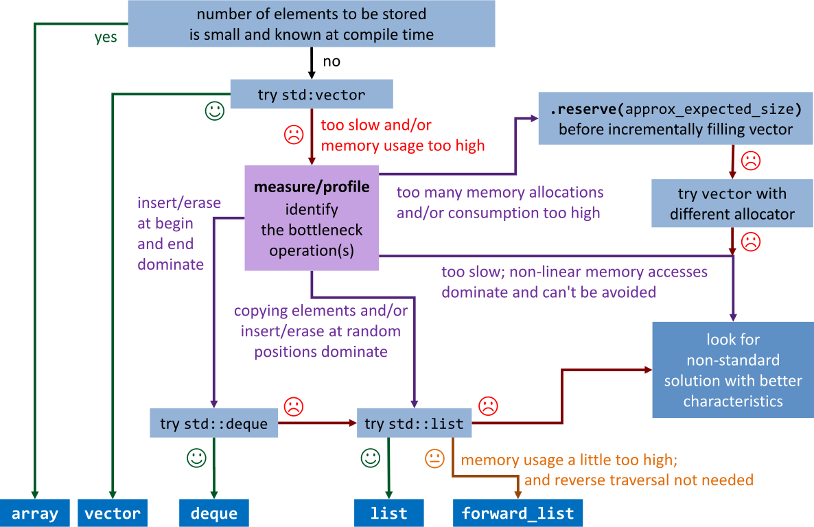
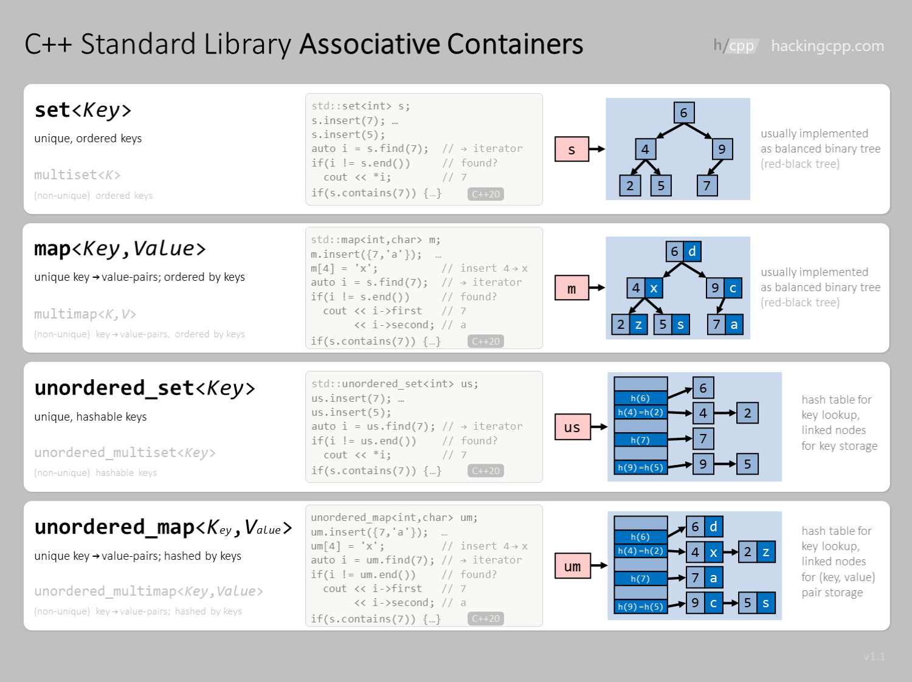
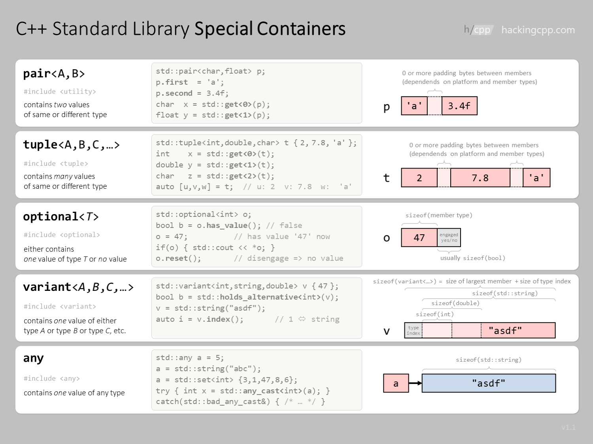
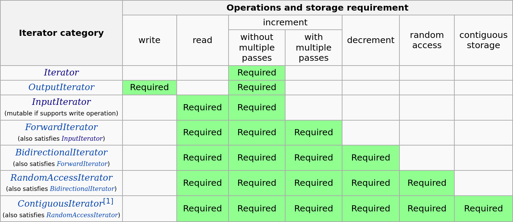
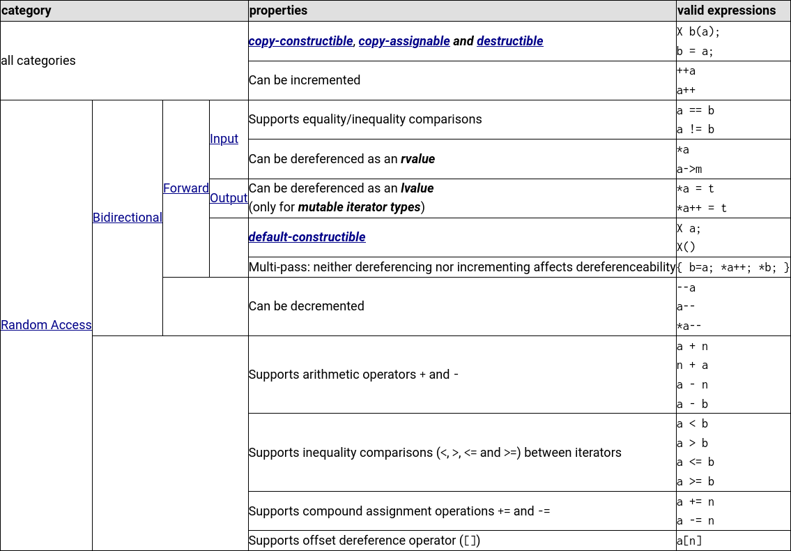

<!--
title: Lecture 06
paginate: true

_class: titlepage
-->

# Lecture 06
<br>

## The Standard Template Library.
<br>

#### Advanced Programming - SISSA, UniTS, 2024-2025

###### Pasquale Claudio Africa

###### 04 Nov 2024

---

# Outline

1. Containers
   - Sequence containers
   - Container adaptors
   - Associative containers
   - Special containers
2. Iterators
3. Algorithms
4. Evolution of the STL

---

<!--
_class: titlepage
-->

# An overview of the<br>Standard Template Library (STL) in C++

---

# History

In November 1993, Alexander Stepanov introduced the Standard Template Library (STL) to the ANSI/ISO committee for C++ standardization. This library was founded on the principles of generic programming and featured generic containers, iterators, and a comprehensive set of algorithms designed to operate on them.

The proposal was not only accepted but also paved the way for what is now known as the Standard Library. The Standard Library has evolved into a vast collection of tools that play an indispensable role in modern C++ development.

Notably, all functionalities provided by the Standard Library are encapsulated under the `std::` namespace or, in some cases, within sub-namespaces also contained within `std::`.

---

# The Boost libraries

Many components added to the Standard Library over the years were originally proposed in the [Boost C++ libraries](https://www.boost.org/), a collection of libraries designed to complement the Standard Library and cater to a wide range of applications.

Notably, one outstanding component within the Boost libraries is the [Boost Graph Library](https://www.boost.org/doc/libs/1_72_0/libs/graph/doc/index.html), widely used by professionals working with graphs and networks.

All Boost libraries are open-source and can be installed individually or as a whole on various Linux platforms using package managers. For instance, on Ubuntu, you can use the command `sudo apt-get install libboost-all-dev`. Alternatively, you can download the source code and compile them manually.

---

# An overview of the STL (1/2)

- **Porting of C libraries**: Several C libraries have been adapted to the `std` namespace. As an example, `<math.h>` becomes `<cmath>`, and they all begin with a 'c'.
- **Containers**: Generic containers and iterators.
- **Utilities**: Smart pointers, fixed-size collections of heterogeneous values like `pair` and `tuple`, clocks and timers, function wrappers, and predefined functors. Also, the `ratio` class for constant rationals.
- **Algorithms**: These operate on ranges of values, usually stored in standard containers, to perform specific actions like sorting, transformations, and copying. Some of them even support parallel execution.
- **Strings and text processing**: The `string` class and its derived classes, regular expressions, and efficient string manipulation tools.
- **Support for I/O**: I/O streams and related utilities.
- **Utilities for diagnostics**: Standard exception classes and exception handlers.

---

# An overview of the STL (2/2)

- **Numerics**: `complex<T>`, numeric limits, random numbers and distributions, and basic mathematical operators.
- **Support for generic programming**: Type traits, `declval`, and `as_const`.
- **Support for reference and move semantics**: Reference wrappers, `move()`, and `forward<T>`.
- **Support for multithreading and concurrency**: Threads, mutexes, locks, and parallel algorithms.
- **Support for internationalization**: `locale` and `wide_char`.
- **Filesystem**: Tools for examining the file system.
- **Allocators**: Utilities that allow you to change how objects are allocated within containers.
- **Utilities for hybrid data**: `optional`, `variant`, and `any`.

---

# A milestone: C++11

- **Standardization process**: C++11 marked the successful completion of a rigorous standardization process.
- **Modern features**: C++11 introduced modern language features like lambda expressions and range-based for loops.
- **Enhanced Standard Library**: New containers, algorithms, and utility classes.
- **Improved memory management**: Smart pointers were introduced in C++11.
- **Initializer lists**: C++11 introduced initializer lists, simplifying data structure initialization.
- **Simpler and safer code**: The addition of lambda expressions improved code readability and maintainability.
- **Standardized threads**: It brought a standardized threading library, enabling concurrent and parallel programming.
- **Improved performance**: Move semantics and rvalue references boosted resource management and program performance.

---

<!--
_class: titlepage
-->

# Containers

---

# Sequence containers

Containers can be categorized based on how data is stored and handled internally. The categories include:

- **Sequence containers**: `std::vector<T>`, `std::array<T,N>`, `std::deque<T>`, `std::list<T>`, `std::forward_list<T>`.
  - Ordered collections of elements with their position independent of the element value.
  - In `std::vector` and `std::array`, elements are guaranteed to be contiguous in memory and can be accessed directly using the `[]` operator.

- **Adaptors**: These are built on top of other containers and provide special operations:
  - `std::stack<T>`, `std::queue<T>`, and `std::priority_queue<T>`.

---

# Example: `std::vector`

```cpp
std::vector<int> v{2,4,5}; // 2, 4, 5.
v.push_back(6);            // 2, 4, 5, 6.
v.pop_back();              // 2, 4, 5.
v[1] = 3;                  // 3, 4, 5.
std::cout << v[2];         // 5
for (int x : v)
    std::cout << x << ' '; // Prints: 2 3 5
std::cout << std::endl;

v.reserve(8);
v.resize(5, 0);
std::cout << v.capacity() << std::endl;
std::cout << v.size() << std::endl;
```

---

# Example: `std::array`

```cpp
std::array<int, 6> a{4,8,15,16,23,42};
std::cout << a.size() << std::endl;    // 6
std::cout << a[0] << std::endl;        // 4
std::cout << a[3] << std::endl;        // 16
std::cout << a.front() << std::endl;   // 4
std::cout << a.back() << std::endl;    // 42

std::array<int, 3> b{7,8,9};
// a = b;  // Compiler error: types don't match!
```

---


[Source](https://hackingcpp.com/cpp/cheat_sheets.html)

---

# Which sequence container to choose?



---

# Associative containers (1/3)

- **Associative containers**: These collections have elements whose position depends on their content. They are divided into:
  - **Maps**: Elements are key-value pairs.
  - **Sets**: Elements are just values (in sets, keys and values are considered the same).
  - Furthermore, they can be divided into **ordered** and **unordered**, depending on how the elements are stored, imposing different requirements on element types.

#### :warning: In a set, the terms "value" and "key" are used interchangeably since they are equivalent.

---

# Associative containers (2/3)

- **Ordered associative containers**:
  - `std::set<K>` (no repetition) and `std::multiset<K>` (repetition allowed): They store single values, and the value is the key.
  - `std::map<K,V>` (no repetition of keys) and `std::multimap<K,V>` (repetition of keys allowed): They store pairs of (key, value) and act as **dictionaries**.
  
- An ordering relation must be defined for the key `K`. It can be done using a specific callable object, a specialization of the functor `std::less<K>`, or by defining `operator<()`.
- Keys can be accessed read-only; modifications of keys require special operations.

---

# Associative containers (3/3)

- **Unordered associative containers**:
  - `std::unordered_set<K>` and `std::unordered_multiset<K>`.
  - `std::unordered_map<K,V>` and `std::unordered_multimap<K,V>`.

- Their general behavior is similar to that of the ordered counterparts.
- A hashing function, mapping keys to positive integers in a range [0, max), should be provided along with a proper equivalence relation among keys.
- For standard types, a default hash function is provided by the library, as well as relational operators.

---



[Source](https://hackingcpp.com/cpp/cheat_sheets.html)

---

# Example: `std::map`

```cpp
std::map<std::string, int> age; // Creating a std::map with string keys (names) and integer values (ages).

// Inserting key-value pairs into the map. Elements are automatically sorted by key.
age["Alice"] = 25;
age["Charlie"] = 22;
age["Charlie"] = 23; // Overwrite the previous value.
age["Bob"] = 30;

// Accessing elements by key.
const std::string name = "Charlie";
if (age.find(name) != age.end()) {
    std::cout << name << " is " << age[name] << " years old." << std::endl;
} else {
    std::cout << "Information about " << name << " not found." << std::endl;
}

const int age_david = age.at("David"); // Throw an exception if "David" is not present.
const int age_david2 = age["David"];   // WARNING: this will allocate "David" if not present!

// Iterating through the map.
std::cout << "Name - Age map:" << std::endl;
for (const auto& entry : age) {
    std::cout << entry.first << " is " << entry.second << " years old." << std::endl;
}
```

---

# Example: `std::set`

```cpp
std::set<int> numbers; // Creating a std::set of integers.

// Inserting elements into the set. Elements are automatically sorted.
numbers.insert(10);
numbers.insert(30);
numbers.insert(20);
numbers.insert(10); // Duplicate, won't be added.
numbers.insert(20); // Duplicate, won't be added.

// Checking if an element is in the set.
const int search_value = 20;
if (numbers.find(search_value) != numbers.end()) { // Or, since C++20: if (numbers.contains(search_value))
    std::cout << search_value << " is in the set." << std::endl;
} else {
    std::cout << search_value << " is not in the set." << std::endl;
}

// Iterating through the set.
for (const int& num : numbers) {
    std::cout << num << " ";
}
std::cout << std::endl;
```
    
---

# Special containers: `std::byte`

**`std::byte`** is a relatively low-level data type introduced in C++17, and its primary use is to represent individual bytes in memory, often used for bitwise operations and when dealing with raw memory. `std::byte` can be used for encoding and decoding data:

## Example
```cpp
std::byte flags = std::byte(0b11001010);
std::byte mask = std::byte(0b11110000);
std::byte result = flags & mask; // Bitwise AND operation.
```

---

# Special containers: `std::pair`

**`std::pair`** represents a pair of values. It's commonly used to combine two values into a single entity.

## Example

```cpp
std::pair<double, double> min_max(const std::vector<double> &vec) {
    // Compute min_val and max_val.
    return std::make_pair(min_val, max_val);
}

std::vector<double> data;
// ...
const std::pair<double, double> result = min_max(data);

std::cout << "Minimum value: " << result.first << std::endl;
std::cout << "Maximum value: " << result.second << std::endl;
```

---

# Special containers: `std::tuple`

**`std::tuple`** is a generalization of `std::pair` representing a heterogeneous collection of values. It can hold elements of different types.

## Example

```cpp
std::tuple<std::string, int, std::string> get_person_info() {
    return std::make_tuple("Alice", 28, "Engineer");
}

std::tuple<std::string, int, std::string> person = get_person_info();

// Access and display the individual elements of the tuple.
const std::string name = std::get<0>(person);
const int age = std::get<1>(person);
const std::string occupation = std::get<2>(person);
```

---

# Special containers: `std::variant`

**`std::variant`** represents a type-safe union of types, allowing you to hold one value from a set of specified types.

## Example

```cpp
std::variant<double, std::string> var;

var = "Hello"; // Hold a string.
var = 10.5;    // Hold a double.

const double c = std::get<double>(var); // c is now 10.5.

std::string s = std::get<std::string>(var); // Runtime error: not currently holding a string!!

// But I can check.
if (var.holds_alternative<std::string>()) {
    // It's a string.
}
```

---

# Special containers: `std::optional`

**`std::optional`** is a special wrapper introduced in C++17 for a type that behaves partially similarly to a pointer but is convertible to `bool`, with `false` indicating that the value is missing or unset. It also contains other methods to interrogate its content.

## Example

```cpp
// A vector of optionals storing a double.
std::vector<std::optional<double>> data(100); // All elements are unset.
data[10] = 45.27; // You set the optional just by assigning the value.
auto d = data[7]; // This is unset: you can interrogate it.

if (d.has_value()) // Or: if (d)
    std::cout << d.value() << std::endl;
else
    std::cout << "Value unset";
    
const double value_or_default = data[20].value_or(1.5);
```

---

# Special containers: `std::any`

**`std::any`** is a class introduced in C++17 that provides a dynamic, type-safe container for holding values of any type. It allows you to store and retrieve objects of different types in a type-safe manner.

```cpp
std::any data;

data = 42; // Store an integer.

if (data.type() == typeid(int)) {
    const int value = std::any_cast<int>(data);
}

data = std::string("Hello, world!"); // Store a string.

if (data.type() == typeid(std::string)) {
    const std::string value = std::any_cast<std::string>(data);
}
```

---



[Source](https://hackingcpp.com/cpp/cheat_sheets.html)

---

<!--
_class: titlepage
-->

# Iterators

---

# Iterators

Iterators are a generalization of **pointers** that allow a C++ program to work with different data structures (for example, **containers** and ranges (since C++20)) in a uniform manner. The iterator library provides definitions for iterators, as well as iterator traits, adaptors, and utility functions.

Since iterators are an abstraction of pointers, their semantics are a generalization of most of the semantics of pointers in C++. This ensures that every function template that takes iterators works as well with regular pointers. 

## Basic functionality

An iterator is **any object** that allows iterating over a succession of elements, typically stored in a standard container. It can be **dereferenced** with the `*` operator, returning an element of the range, and incremented (moving to the next element) with the `++` operator.

---


[Source](https://en.cppreference.com/w/cpp/iterator)

#### :warning: C++20 has redefined the categories with [ranges](https://en.cppreference.com/w/cpp/ranges). Old ones are now referred to as Legacy.

---



[Source](https://cplusplus.com/reference/iterator/)

---

# Containers iterators

All main containers have iterators that belong to the **Forward** category. `std::array` and `std::vector` have **Random access** iterators.

**All containers** have the methods `begin()` and `end()` iterator to the first and the *(last + 1)-n*th element in the container (`cbegin()` and `cend()` return the `const` equivalents). You may also use the corresponding free functions `std::begin()` and `std::end()`, which can be overloaded for any type.

**All containers** define the types `Container::iterator`, `Container::reverse_iterator`, and the corresponding `const` versions (`Container::const_iterator`, etc.).

#### :warning: In a const iterator, it is the pointed element that is `const`, not the iterator itself! More precisely, it is an *iterator to `const`*.

#### :warning: `auto` simplifies the use of iterators!

---

# Methods and types in containers (1/2)

- Default, copy, and move constructors
- `Container c(beg, end)`: Constructor from the range $[\mathrm{beg}, \mathrm{end})$
- `size()`: Number of stored elements
- `empty()`: `true` if empty
- `max_size()`: Max number of elements that can be stored
- Comparison operators
- `c1 = c2`: Copy assignment, `c1` may be a container of a different type from `c2`
- `c1.swap(c2)`: Swaps data (`c2` may be a container of different type)
- `std::swap(c1, c2)`: As above (as a free function)

---

# Methods and types in containers (2/2)

- `begin()`: Iterator to the first element
- `end()`: Iterator to the position after the last element
- `rbegin()`: Reverse iterator for reverse iteration (initial position)
- `rend()`: Reverse iterator (position after the last element)
- `cbegin(), cend(), crbegin(), crend()`: Same as above, but iterating over `const` elements
- `insert(pos, elem)`: Inserts a copy of elem (return value may differ)
- `emplace(pos, args...)`: Inserts an element by constructing it in place
- `erase(beg, end)`: Removes all elements in the range $[\mathrm{beg}, \mathrm{end})$
- `clear()`: Removes all elements (makes the container empty)

---

# Types defined by containers

- `C::value_type`: The type of the object stored in a container. `value_type` must be assignable and copy constructible, but need not be default constructible.
- `C::iterator`: The type of the iterator used to iterate through a container's elements.
- `C::const_iterator`: A type of iterator that may be used to examine but not modify a container's elements.
- `C::reference`: A type that behaves as a reference to the container's value type.
- `C::const_reference`: A type that behaves as a const reference to the container's value type.
- `C::pointer`: A type that behaves as a pointer to the container's value type.
- `C::difference_type`: A signed integral type used to represent the distance between two of the container's iterators.
- `C::size_type`: An unsigned integral type that can represent any nonnegative value of the container's distance type.

---

# Why types in a container?

Having the type of the contained elements defined in the container may seem peculiar. After all, the type of elements in a `vector<T>` is just `T`! However, this technique is useful in generic programming:

```cpp
template <typename Container>
void my_fun(Container &c) {
    using ValueType = typename Container::value_type;
    // ...
    ValueType a;
}
```

The `auto` specifier and `decltype()` reduce this need. For instance, you could have written:

```cpp
using ValueType = decltype(*(c.begin()));
```

But being explicit is often better! Having traits to specify type members gives a lot of flexibility (and indeed the standard library uses traits...).

---

# Distance between iterators

The distance between iterators is equal to the number of elements in the range defined by them.

```cpp
{
    const std::set<int> my_set = {10, 20, 30, 40, 50};

    auto first = my_set.lower_bound(20); // Iterator to the first element >= 20.
    auto second = my_set.lower_bound(40); // Iterator to the first element >= 40.
    const int distance = std::distance(first, second); // Calculate the distance.
}
{
    const std::vector<int> my_vector = {1, 2, 3, 4, 5};

    auto first = my_vector.begin();
    auto second = std::find(my_vector.begin(), my_vector.end(), 4); // Return iterator to element 4.
    const int distance = std::distance(first, second); // Calculate the distance.
}
```

Distance may be negative if iterators are **random access**.

---

# `size_type` and `std::size_t`

`Container::size_type` in a sequence container is the type used as an argument in `operator[]`, defined for these containers.

It is guaranteed to be an unsigned integral type. Use it instead of `int` or `unsigned int` if you anticipate problems with implicit conversions. `size_type` is implementation-dependent (it may vary between 32-bit and 64-bit architectures).

By default, it is set equal to `std::size_t`, defined in `<cstddef>`, which is the type used to address ordinary arrays.

If you want to be safe, use `std::size_t` or `Container::size_type` to address sequential containers.

```cpp
for (std::size_t i = 0; i < a.size(); ++i)
    a[i] = ...;
```

---

<!--
_class: titlepage
-->

# Algorithms

---

# Ranges (sequences)

The term **range** (or *sequence*) refers to a pair of iterators that define an interval of elements that are "logically adjacent" within a container.

We provide a working definition. Two iterators `b` and `e` define a valid range $[b, e)$ if the instruction:

```cpp
for (iterator p = b; p != e; ++p) {
    *p;
}
```

is valid, and `*p` returns the value of an element of the container.

The algorithms of the standard library typically operate on sequences.

---

# Algorithms

The STL provides an extensive set of algorithms to operate on containers, or more precisely on **ranges**. 

For a full list, you may look [here](https://en.cppreference.com/w/cpp/algorithm) for generic algorithms and [here](https://en.cppreference.com/w/cpp/numeric) for numeric algorithms.

#### :warning: C++20 has revised the concept of range and provides a new set of algorithms in the namespace `std::ranges`, with the same name as the old ones, but simpler to use and sometimes more powerful.

---

# Why using a standard algorithm?

Many standard algorithms can be implemented using a for loop. So what's the advantage? I start by saying that there is nothing wrong with the for-loop version. If you are happy with it, use it. Yet with standard algorithms:

- You are more uniform with respect to different container types.
- The algorithm of the standard library may do certain optimizations if the contained elements have some characteristics.
- You have a parallel version for free (see next slides).


---

# Types of algorithms

## Non-modifying algorithms
They Do not modify the value of the range. They work also on constant ranges.

## Example
```cpp
It std::find(ForwardIt first, ForwardIt last, const T & value)
```
Finds the first occurrence of `value` in the range `[first, last)`.

---

# Types of algorithms

## Modifying algorithms

They either modify the given range, like
```cpp
void std::fill(ForwardIt first, ForwardIt last, const T& value);
```
assigns the given `value` to the elements in the range `[first, last)`.

Or, they copy the result of an operation into another (existing) range. For instance
```cpp
OutIt std::copy(InIt first, InIt last, OutIt result);
```
copies `[first, last)` into the range that starts at `result`.

---

# Inserters

Inserters are special iterators used to insert values into a container. Three main types:

- `std::back_inserter(Container& x)`: Inserts at the back (only for sequential containers).
- `std::front_inserter(Container& x)`: Inserts in the front (only for sequential containers).
- `std::inserter(Container& x, It position)`: Inserts after the indicated position.

## Example

```cpp
std::copy(a.begin(), a.end(), std::front_inserter(c));
```

The computational cost depends on the type of container!

---

# Example: `std::inserter`

Several algorithms require writing the output to a non-const range indicated by the iterator to its beginning. Without inserters, it would be impossible to use them on a non-sequential container or on a sequential container of insufficient size.

```cpp
std::vector<double> a;
std::set<double> b;

std::copy(a.begin(), a.end(), b.begin()); // ERROR: b is not large enough.
```

You need an inserter:
```cpp
std::copy(a.begin(), a.end(), std::inserter(b, b.begin())); // Ok.
```

For an associative container, the second argument of `inserter` is taken only as a suggestion.

---

# Types of algorithms

## Sorting

- Particular modifying algorithms operating on a range to order it according to an ordering relation (default: `std::less<T>`):

  ```cpp
  std::vector<double> a;

  // Descending order: a[i+1] <= a[i].
  std::sort(a.begin(), a.end(), std::greater<double>());
  
  // Ascending order: a[i+1] >= a[i].
  std::sort(a.begin(), a.end());
  ```

---

# Operating on sorted ranges

- Search algorithms:
  ```cpp
  bool std::binary_search(It first, It last, const T& value);
  ```
  returns true if the `value` is present.
- Set union, intersection, and difference (they do not need to be a `std::set<T>`, it is sufficient that the range is ordered):
  ```cpp
  std::set<int> a;
  std::set<int> b;
  // ...
  set<int> c;
  std::set_union(a.begin(), a.end(), b.begin(), b.end(), std::inserter(c, c.begin()));
  ```
  Now $c = a \cup b$.

#### :warning: Remember that a `std::set` is already ordered!

---

# Types of algorithms

## Min and Max

- A series of algorithms to find the minimum and maximum element in a range:
  ```cpp
  template <class T>
  const T& max(const T& a, const T& b);

  template <class T>
  const T& min(const T& a, const T& b);

  template <class T, class Compare>
  const T& max(const T& a, const T& b, Compare comp);

  template <class T>
  std::pair<const T&, const T&> minmax(const T& a, const T& b);

  template <class InputIt1, class InputIt2>
  bool lexicographical_compare(InputIt1 first1, InputIt1 last1,
                               InputIt2 first2, InputIt2 last2);
  ```

---

# Types of algorithms

## Numeric operations

- Numeric operations are available in `<numeric>`.

- Examples:
  ```cpp
  std::vector<double> v;
  std::vector<double> w;

  // Sum of a range.
  auto sum = std::accumulate(v.begin(), v.end(), 0);

  // Product of a range.
  auto product = std::accumulate(v.begin(), v.end(), 1, std::multiplies<double>());

  // The same with lambdas.
  auto product = std::accumulate(v.begin(), v.end(), 1, [](double a, double b) { return a * b; });

  auto r1 = std::inner_product(v.begin(), v.end(), w.begin(), 0);
  ```

---

# `std::transform`

- Another very flexible algorithm is `std::transform`, present in two forms:
  ```cpp
  OutIt transform(InIt first1, InIt last1, OutIt result, UnaryOperator op);
  OutIt transform(InIt1 first1, InIt1 last1, InIt2 first2, OutIt result, BinaryOperator binary_op);
  ```
- You can apply unary or binary functions to elements in a range.
- The length of the ranges must be consistent (no check is made).

## Example

```cpp
std::set<double> a;
std::list<double> l;
// ...

std::vector<double> b(a.size());
std::transform(a.begin(), a.end(), l.begin(), b.begin(), std::plus<double>());
```
$b$ now contains $a + l$.

---

# A list of other interesting algorithms (1/2)

- `std::for_each`: Apply a function to a range.
- `std::find_if`: Find the first element satisfying a predicate.
- `std::count`: Count appearances of a value in a range.
- `std::count_if`: Return the number of elements in a range satisfying a predicate.
- `std::replace`: Replace a value.
- `std::replace_if`: Replace values in a range satisfying a predicate.
- `std::replace_copy`: Copy a range while replacing values.
- `std::replace_copy_if`: Copy a range, replacing values satisfying a predicate.
- `std::fill`: Fill a range with a value.
- `std::fill_n`: Fill `n` elements with a value.
- `std::generate`: Generate values according to a given unary function.

---

# A list of other interesting algorithms (2/2)

- `std::remove_if`: Remove elements satisfying a predicate.
- `std::remove_copy`: Remove values and copy them to another range.
- `std::remove_copy_if`: Remove elements satisfying a predicate and copy.
- `std::unique`: Remove consecutive duplicates.
- `std::random_shuffle`: Rearrange elements in a range randomly.
- `std::partition`: Partition a range into two.
- Operations on sorted ranges, such as union, intersection, etc.

Full list [here](https://en.cppreference.com/w/cpp/algorithm) and [here](https://en.cppreference.com/w/cpp/numeric) for numerical functions and algorithms.

---

# Parallel algorithms

- Since C++17, most STL algorithms now support parallel execution via multi-threading.
- Execution policies:
  - `std::execution::seq`: Sequential execution (no parallelization).
  - `std::execution::par`: Parallel sequenced execution.
  - `std::execution::par_unseq`: Parallel unsequenced execution (vectorization).
  - The last execution policy is activated only if the hardware supports it.
- Be careful with data races; ensure your procedure is parallelizable.
- C++ provides tools to control parallel execution finely (mutexes, etc.), but their use is complex and beyond the scope of this course.

---

# Example: parallel algorithms

```cpp
std::vector<int> v;

// Find element using parallel execution policy.
auto result1 = std::find(std::execution::par, std::begin(v), std::end(v), 2);

// Sort elements using sequential execution policy.
auto result2 = std::sort(std::execution::seq, std::begin(v), std::end(v));
```

---

<!--
_class: titlepage
-->

# Evolution of the STL

---

# Evolution of the STL

The C++ Standard Template Library (STL) has seen several enhancements and improvements in each major C++ standard release, including C++11, C++14, C++17, C++20, and C++23. Here's a summary of the main introductions to the STL in each of these versions.

## References and further reading

- [C++ reference](https://en.cppreference.com/w/cpp)
- [Modern C++ for Absolute Beginners](https://link.springer.com/book/10.1007/978-1-4842-9274-7): A Friendly Introduction to the C++ Programming Language and C++11 to C++23 Standards, Slobodan Dmitrović, Apress, March 2023.
- [Evolution since C++11](https://github.com/AnthonyCalandra/modern-cpp-features)
- [Learn modern C++](https://github.com/kybuivan/learn-programming-languages/tree/main/cpp)

---

# C++11

1. [Move semantics](https://github.com/AnthonyCalandra/modern-cpp-features/blob/master/CPP11.md#move-semantics)
2. [Variadic templates](https://github.com/AnthonyCalandra/modern-cpp-features/blob/master/CPP11.md#variadic-templates)
3. [Rvalue references](https://github.com/AnthonyCalandra/modern-cpp-features/blob/master/CPP11.md#rvalue-references)
4. [Lambda expressions](https://github.com/AnthonyCalandra/modern-cpp-features/blob/master/CPP11.md#lambda-expressions)
5. [`auto`](https://github.com/AnthonyCalandra/modern-cpp-features/blob/master/CPP11.md#auto)
6. [`nullptr`](https://github.com/AnthonyCalandra/modern-cpp-features/blob/master/CPP11.md#nullptr)
7. [Range-based for loops](https://github.com/AnthonyCalandra/modern-cpp-features/blob/master/CPP11.md#range-based-for-loops)
8. [Smart pointers](https://github.com/AnthonyCalandra/modern-cpp-features/blob/master/CPP11.md#smart-pointers)
9. [Type traits](https://github.com/AnthonyCalandra/modern-cpp-features/blob/master/CPP11.md#type-traits)
10. ...

---

# C++14

1. [Binary literals](https://github.com/AnthonyCalandra/modern-cpp-features/blob/master/CPP14.md#binary-literals)
2. [Generic lambdas](https://github.com/AnthonyCalandra/modern-cpp-features/blob/master/CPP14.md#generic-lambda-expressions)
3. [Return type deduction](https://github.com/AnthonyCalandra/modern-cpp-features/blob/master/CPP14.md#return-type-deduction)
4. [`decltype(auto)`](https://github.com/AnthonyCalandra/modern-cpp-features/blob/master/CPP14.md#decltypeauto)
5. [Variable templates](https://github.com/AnthonyCalandra/modern-cpp-features/blob/master/CPP14.md#variable-templates)
6. [User-defined literals for standard library types](https://github.com/AnthonyCalandra/modern-cpp-features/blob/master/CPP14.md#user-defined-literals-for-standard-library-types)
7. ...

---

# C++17

1. [Template argument deduction for class templates](https://github.com/AnthonyCalandra/modern-cpp-features/blob/master/CPP17.md#template-argument-deduction-for-class-templates)
2. [Fold expressions](https://github.com/AnthonyCalandra/modern-cpp-features/blob/master/CPP17.md#folding-expressions)
3. [Lambda capture `this` by value](https://github.com/AnthonyCalandra/modern-cpp-features/blob/master/CPP17.md#lambda-capture-this-by-value)
4. [Structured bindings](https://github.com/AnthonyCalandra/modern-cpp-features/blob/master/CPP17.md#lambda-capture-this-by-value)
5. [`constexpr if`](https://github.com/AnthonyCalandra/modern-cpp-features/blob/master/CPP17.md#constexpr-if)
6. [UTF-8 character literals](https://github.com/AnthonyCalandra/modern-cpp-features/blob/master/CPP17.md#utf-8-character-literals)
7. [New library features like `std::variant`, `std::optional`, and `std::any`](https://github.com/AnthonyCalandra/modern-cpp-features/blob/master/CPP17.md#c17-library-features)
8. ...

--- 

# C++20

1. [Coroutines](https://github.com/AnthonyCalandra/modern-cpp-features/blob/master/CPP20.md#coroutines)
2. [Concepts](https://github.com/AnthonyCalandra/modern-cpp-features/blob/master/CPP20.md#concepts)
3. [Ranges](https://en.cppreference.com/w/cpp/ranges)
4. [Modules](https://en.cppreference.com/w/cpp/language/modules)
5. [Designated initializers](https://github.com/AnthonyCalandra/modern-cpp-features/blob/master/CPP20.md#designated-initializers)
6. [Template syntax for lambdas](https://github.com/AnthonyCalandra/modern-cpp-features/blob/master/CPP20.md#template-syntax-for-lambdas)
7. [`constexpr` virtual functions](https://github.com/AnthonyCalandra/modern-cpp-features/blob/master/CPP20.md#constexpr-virtual-functions)
8. [New library features, including `std::span` and math constants](https://github.com/AnthonyCalandra/modern-cpp-features/blob/master/CPP20.md#c20-library-features)
9. ...

---

# C++23 (still subject to variation)

1. **Concepts in STL**: Further adoption of concepts in STL algorithms and containers.
2. **Improved parallelism**: Expanding parallel algorithms and enhancing support for parallel execution.
3. **Reflection**: Potential support for reflection, making it easier to inspect and manipulate types at runtime.
4. **Networking library**: The Networking library might become part of the standard, adding networking capabilities.
5. **Enhanced ranges**: Expanding and refining the ranges library with new utilities.
6. ...

#### [Source](https://en.cppreference.com/w/cpp/23)

---

# Example: the evolution of `for` loops (1/5)

## 1. Traditional `for` loop (pre-C++11)

```cpp
std::vector<int> vec = {1, 2, 3, 4, 5};
for (size_t i = 0; i < vec.size(); ++i) {
    std::cout << vec[i] << " ";
}
```

- **Usage**: Commonly used before C++11.
- **Explanation**: This form uses an integer index to access elements. It works with any indexable container (like `std::vector` or `std::array`).
- **Pros**: Allows direct access to both the index and the element, which is useful when you need the position of elements.
- **Cons**: Can be error-prone with boundary conditions, and may be inefficient if the container recalculates `size()` each time.

---

# Example: the evolution of `for` loops (2/5)

## 2. `for` loop with iterators (pre-C++11)

```cpp
std::vector<int> vec = {1, 2, 3, 4, 5};
for (std::vector<int>::iterator it = vec.begin(); it != vec.end(); ++it) {
    std::cout << *it << " ";
}
```

- **Usage**: A step toward more generic and flexible loops.
- **Explanation**: Uses iterators instead of an index, making it adaptable to all STL containers, including those without random-access iterators (like `std::list`).
- **Pros**: Supports non-indexable containers and is more generic.
- **Cons**: Verbose syntax and the need for dereferencing (`*it`) can make code harder to read.

---

# Example: the evolution of `for` loops (3/5)

## 3. Range-based `for` loop (C++11)

```cpp
std::vector<int> vec = {1, 2, 3, 4, 5};
for (int value : vec) { // Or: for (const auto value : vec)
    std::cout << value << " ";
}
```

- **Usage**: Introduced in C++11, this syntax is much more concise and readable.
- **Explanation**: Automatically loops over elements in the container without the need for iterators or indices.
- **Pros**: Simple, concise, and avoids off-by-one errors. Great for most use cases where you just need the element value.
- **Cons**: Limited flexibility - doesn't provide access to the index, and modifying elements requires using a reference (`for (int &value : vec)`).

---

# Example: the evolution of `for` loops (4/5)

## 4. Structured bindings (C++17)

```cpp
std::tuple<int, std::string, double> my_tuple{1, "a string", 2.5};
const auto [i, s, d] = my_tuple; // Unpack tuple.

std::map<int, std::string> my_map = {{1, "one"}, {2, "two"}};
for (const auto& [key, value] : my_map) {
    std::cout << key << ": " << value << "\n";
}
```

- **Usage**: Simplifies code when looping over key-value pairs in associative containers.
- **Explanation**: Introduced in C++17, structured bindings allow unpacking of key-value pairs directly within the loop.
- **Pros**: Very readable and works well with `std::map` and `std::unordered_map`.
- **Cons**: Limited to associative containers; doesn’t add much benefit when used with containers like `std::vector`.

---

# Example: the evolution of `for` loops (5/5)

## 5. Range-Based `for` with `std::ranges` (C++20)

```cpp
#include <ranges>

for (int value : vec | std::views::reverse) {
    std::cout << value << " ";
}
```

- **Usage**: Introduced with the ranges library in C++20.
- **Explanation**: Adds flexibility by allowing modifications (like `reverse`, `filter`, `transform`) directly in the loop using range adaptors.
- **Pros**: Makes the loop more expressive and reduces the need for external functions to modify sequences.
- **Cons**: Requires understanding of range adaptors and may not be necessary for simpler loops.

---

# Conclusion

The STL is a fundamental part of the C++ standard library, offering a rich set of data structures, algorithms, and utilities that make C++ a powerful and expressive language. To fully harness the power of the STL:

1. **Algorithm usage**: Algorithms are the backbone of the STL. Utilize them to simplify and optimize common operations, enhancing code readability and maintainability.
2. **Container selection**: Choose the appropriate container type (e.g., `std::vector`, `std::map`, `std::queue`) based on your specific needs. This decision greatly impacts your code's efficiency.
3. **Smart pointers**: Smart pointers like `std::shared_ptr` and `std::unique_ptr` are crucial for effective memory management, preventing memory leaks and resource leaks.
4. **Newer features**: Stay up-to-date with the latest C++ standards (e.g., C++20, C++23) and incorporate new features like ranges, concepts, and structured bindings to write cleaner and more efficient code.

---

<!--
_class: titlepage
-->

# :arrow_right: Smart pointers, move semantics, utilities from the STL.
